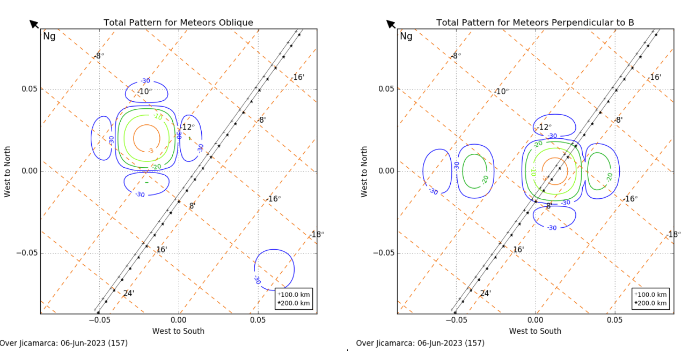

# Meteors Experiment — June 2023

## 1. Experiment Overview

This document describes the radar configuration and experimental parameters used during the meteor observations conducted at the Jicamarca Radio Observatory (JRO) in June 2023.

The experiment consisted of two observation configurations:

* **Perpendicular:** 5 June 2023, 20:00–08:00 LT
* **Oblique:** 6 June 2023, 20:00–08:00 LT

The observations were performed using the HPLA main radar with four receiving channels.

## 2. Antenna Configuration

The receiving system used four antenna sectors. For consistency with the notation used in the paper, the receiving channels are identified as:

| Channel | Antenna sector |
| ------- | -------------- |
| A       | North quarter  |
| B       | East quarter   |
| C       | West quarter   |
| D       | South quarter  |

The transmitter antennas were configured in the **all-down** direction during the experiment.

<!-- The original experimental documentation identifies the receiving antenna connections as A: Edw, B: Sdw, C: Wdw, and D: directional coupler. The notation above follows the quadrant convention used in the assoiated paper. -->

## 3. Beam Pattern

The beam pattern for each configuration is shown in the following figure.

## 4. Radar and Acquisition Parameters

The main experimental parameters were:

| Parameter                    |             Value |
| ---------------------------- | ----------------: |
| IPP                          |             60 km |
| TX                           |           1.95 km |
| Duty cycle                   |            3.25 % |
| Code                         |         Barker 13 |
| Number of transmitters       |                 2 |
| Transmitter power            |         1 MW each |
| H0                           |           -0.6 km |
| DH                           | 0.075 km (0.5 μs) |
| NSA                          |      780 (0.5 μs) |
| Number of receiving channels |                 4 |
| Acquisition system           |              JARS |
| Acquisition rate             |       104 GB/hour |
| Receiver Antenna             |         B, C and D|

The experiment used two 1-MW transmitters, with the transmitter antennas configured all down.

## 5. Transmission and Coding

The transmitted waveform used a **Barker 13** code. Two transmitters were used during the experiment, with a transmitter power of approximately 1 MW per transmitter.

The nominal inter-pulse period (IPP) was 60 km, while the TX parameter was 1.95 km. The reported duty cycle was 3.25%.

## 6. Reference

This documentation is based on the experimental configuration used during the June 2023 meteor campaign at the Jicamarca Radio Observatory.
