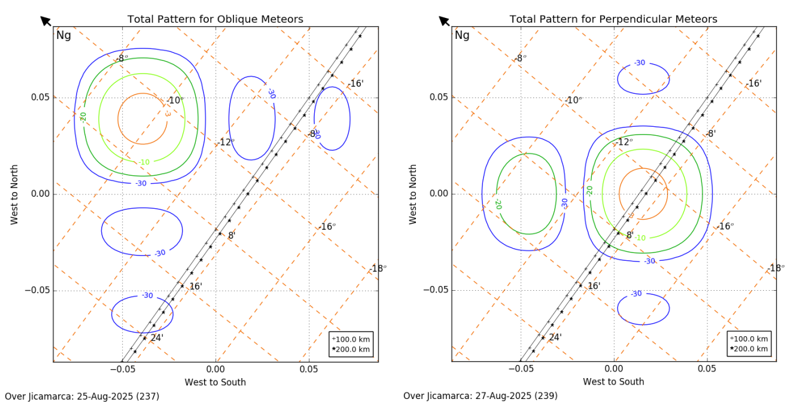

# Meteors Experiment — August 2025

## 1. Experiment Overview

This document describes the radar configuration and experimental parameters used during the meteor observations conducted at the Jicamarca Radio Observatory (JRO) in August 2025.

The experiment consisted of two observation configurations:

* **Oblique:** 25–26 August 2025
* **Perpendicular:** 26–28 August 2025

The observations were performed using the HPLA main radar with four receiving channels.

## 2. Antenna Configuration

The receiving system used four antenna sectors. For consistency with the notation used in the paper, the receiving channels are identified as:

| Channel | Antenna sector |
| ------- | -------------- |
| A       | North quarter  |
| B       | East quarter   |
| C       | West quarter   |
| D       | South quarter  |

The transmitter antenna was configured in the **East Down** direction during the experiment.
 

## 3. Beam Pattern

The beam pattern for each configuration is shown in the following figure.



## 4. Radar and Acquisition Parameters

The main experimental parameters were:

| Parameter                    |                     Value |
| ---------------------------- | ------------------------: |
| Experiment                   |                   Meteors |
| Mode                         |   Oblique / Perpendicular |
| Schedule                     | 25–26 / 26–28 August 2025 |
| IPP                          |                  187.5 km |
| TX                           |                    6.6 km |
| Duty cycle                   |                    3.52 % |
| Code                         |             88 bauds code |
| Number of transmitters       |                         1 |
| Transmitter power            |                    500 kW |
| Transmitter antenna          |                 East Down |
| H0                           |                      0 km |
| DH                           |         0.075 km (0.5 μs) |
| NSA                          |                     2,476 |
| HF                           |                185.625 km |
| Number of receiving channels |                         4 |
| Acquisition system           |                    JARS 2 |
| Acquisition rate             |               106 GB/hour |
| Acquired profiles            |                       800 |
| Receiver Antenna             |         A, C and D; all down|


The experiment used one 500-kW transmitter, with the transmitter antenna configured in the East Down direction. The radar operated with four receiving channels and used the JARS 2 acquisition system.

## 5. Transmission and Coding

The transmitted waveform used an **88-bauds code**. The experiment used one 500-kW transmitter.

The nominal inter-pulse period (IPP) was 187.5 km, while the TX parameter was 6.6 km. The reported duty cycle was 3.52%. The experiment used an NSA of 2,476 and an HF of 185.625 km.

The 88-bauds code used in the experiment was:

```text
1001000001110110010110001001101011110101011100000010010100000010110011100010110011100010
```

## 6. Reference

This documentation is based on the experimental configuration used during the August 2025 meteor campaign at the Jicamarca Radio Observatory.
